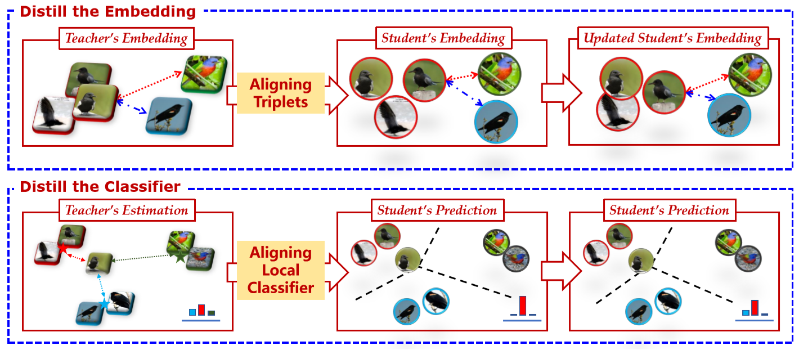

# REFILLED
This is the code of CVPR 2020 oral paper "Distilling Cross-Task Knowledge via Relationship Matching". If you use any content of this repo for your work, please cite the following bib entry:

    @inproceedings{ye2020refilled,
      author    = {Han-Jia Ye and
                   Su Lu and
                   De-Chuan Zhan},
      title     = {Cross-Task Knowledge Distillation via Relationship Matching},
      booktitle = {Computer Vision and Pattern Recognition (CVPR)},
      year      = {2020}
    }
    
## Cross-Task Knowledge Distillation
It is intuitive to take advantage of the learning experience from related pre-trained models to facilitate model training in the current task. Different from fine-tuning or parameter regularization, knowledge distillation/knowledge reuse extracts kinds of dark knowledge/privileged information from a fixed strong model (a.k.a. "teacher"), and enrich the target model (a.k.a. "student") training with more signals. Owing to the strong correspondence between classifier and class,it is difficult to reuse the classification knowledge from a cross-task teacher model.

## Two-Stage Solution - REFILLED
We propose the RElationship FacIlitated Local cLassifiEr Distillation (REFILLED), which decomposes the knowledge distillation flow for embedding and the top-layer classifier respectively. REFILLED contains two stages. First, the discriminative ability of features is emphasized. For those hard triplets determined by the embedding of the student model, the teacher’s comparison between them is used as the soft supervision. A teacher enhances the discriminative embedding of the student by specifying the proportion for each object how much a dissimilar impostor should be far away from a target nearest neighbor. Furthermore, the teacher constructs the soft supervision for each instance by measuring its similarity to a local center. By matching the "instance-label" predictions across models, the cross-task teacher improves the learning efficacy of the student.

## Important Improvements to ReFilled
We further improve our proposed method by extending the dimension of matched tuple probabilities in stage1 and replacing local class centers with global class centers in stage2.

### stage1
TODO

### stage2
TODO

## Experiment Results
REFILLED can be used in several applications, e.g., standard knowledge distillation, cross-task knowledge distillation and middle-shot learning. Standard knowledge distillation is widely used and we show the results under this setting below. Experiment results of cross-task knowledge distillation and middle-shot learning can be found in the paper.

### CIFAR-100 with wide_resnet
|(depth, width)|(40,2)|(16,2)|(40,1)|(16,1)|
|:------------:|:----:|:----:|:----:|:----:|
|Teacher       |[76.04](https://drive.google.com/file/d/1cHOa4sGGf_df1pZhG1SXGHkdy3fk6Us2/view?usp=sharing)      |      |      |      |
|Student       |[76.04](https://drive.google.com/file/d/1lz2wd7CxeLweyCdQD-qyjsmDy52dFbdP/view?usp=sharing)      |[70.15](https://drive.google.com/file/d/1V4UgzUuazpXBLT5ljbeluBTbb46e571I/view?usp=sharing)      |[71.53](https://drive.google.com/file/d/18fEOWIDL02DKQiw3XFOy9p_3753__TDz/view?usp=sharing)      |[66.30](https://drive.google.com/file/d/1XXTjbM2lRn5aqyy2LjpiLfkxcSlMMLLc/view?usp=sharing)      |
|Paper Results               |77.49      |74.01      |72.72      |67.56      |
|REFILLED after stage1 (paper) |55.47      |50.14      |45.04      |38.06      |
|REFILLED after stage1 (new) |**62.12**  |**53.86**  |**52.71**  |**44.33**  |

**Results after stage1 are accuracies of NCM classifier, rather than NMI of clustering.**

### CUB-200 with mobile_net
|width multiplier|1.00|0.75|0.50|0.25|
|:------------:|:----:|:----:|:----:|:----:|
|Teacher       |[76.19](https://drive.google.com/file/d/1ixlWUbmrbnZc2GCYVaGIEIv952Q9hQet/view?usp=sharing)      |      |      |      |
|Student       |[76.19](https://drive.google.com/file/d/1xGm29Ydv_J8ZRgHT4Aa5p1utJo0FKO2P/view?usp=sharing)      |[74.49](https://drive.google.com/file/d/1sVF0Ej1n8I3ZJ9CRcoTs3L9fNaeBaA4b/view?usp=sharing)      |[72.68](https://drive.google.com/file/d/1LWNpNW9XZnrM50cF-_eekTj_EheZzzpP/view?usp=sharing)      |[68.80](https://drive.google.com/file/d/1KbHbxJz9J0INz4LGkPDy-NwWZCf_vp_H/view?usp=sharing)      |
|Paper Results               |78.95      |78.01      |76.11      |73.42      |
|REFILLED after stage1 (paper) |36.56      |33.00      |29.60      |19.10      |
|REFILLED after stage1 (new) |**38.47**  |**36.95**  |**33.71**  |**25.34**  |

**Results after stage1 are accuracies of NCM classifier, rather than NMI of clustering.**

## Code and Arguments
This code implements REFILLED under the setting where a source task and a target task is given. **main.py** is the main file and the arguments it take are listed below.

### Task Arguments
- `data_name`: name of dataset
- `teacher_network_name`: architecture of teacher model
- `student_network_name`: architecture of student model
### Experiment Environment Arguments
- `devices`: list of gpu ids
- `flag_gpu`: whether to use gpu or not
- `flag_no_bar`: whether to use a bar
- `n_workers`: number of workers in data loader
- `flag_tuning`: whether to tune the hyperparameters on validation set or train on the whole training set
### Optimizer Arguments
- `lr1`: initial learning rate in stage 1
- `lr2`: initial learning rate in stage 2
- `point`: when to decrease the learning rate
- `gamma`: the extent of learning rate decrease
- `wd`: weight decay
- `mo`: momentum
### Network Arguments
- `depth`: depth of resnet and wide_resnet
- `width`: width of wide_resnet
- `ca`: channel coefficient of mobile_net
- `dropout_rate`: dropout rate of the network
### Training Procedure Arguments
- `n_training_epochs1`: number of training epochs in stage 1
- `n_training_epochs2`: number of training epochs in stage 2
- `batch_size`: batch size in training
- `tau1`: temperature for stochastic triplet embedding in stage 1
- `tau2`: temperature for local distillation in stage 2
- `lambd`: weight of teaching loss in stage 2