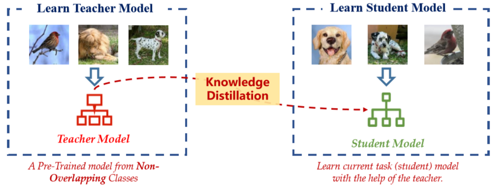

# FEAT
This is the code of CVPR 2020 oral paper "Distilling Cross-Task Knowledge via Relationship Matching". If you use any content of this repo for your work, please cite the following bib entry:

    @inproceedings{ye2020refilled,
      author    = {Han-Jia Ye and
                   Su Lu and
                   De-Chuan Zhan},
      title     = {Cross-Task Knowledge Distillation via Relationship Matching},
      booktitle = {Computer Vision and Pattern Recognition (CVPR)},
      year      = {2020}
    }
    
## Cross-Task Knowledge Distillation
It is intuitive to take advantage of the learning experience from related pre-trained models to facilitate model training in the current task. Different from fine-tuning or parameter regularization, knowledge distillation/knowledge reuse extracts kinds of dark knowledge/privileged information from a fixed strong model (a.k.a. "teacher"), and enrich the target model (a.k.a. "student") training with more signals. Owing to the strong correspondence between classifier and class,it is difficult to reuse the classification knowledge from a cross-task teacher model.

